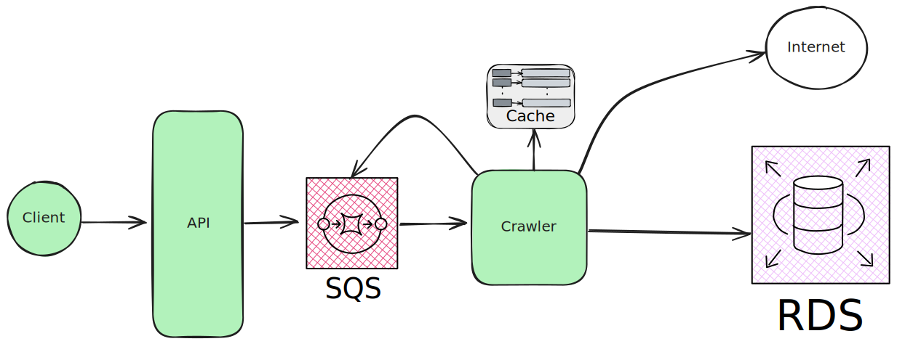

# INDEX
- [TEST DESCRIPTION](#test-description)
- [Functional requirements](#functional-requirements)
- [Non functional requirements](#non-functional-requirements)
- [How to run, test and observe the code](#how-to-run-test-and-observe-the-code)
- [Architecture of reference](#architecture-of-reference)

# TEST DESCRIPTION

---
We'd like you to write a simple web crawler in a programming language you're familiar with. Given a starting URL, the crawler should visit each URL it finds on the same domain. It should print each URL visited, and a list of links found on that page. The crawler should be limited to one subdomain - so when you start with *https://monzo.com/*, it would crawl all pages on the monzo.com website, but not follow external links, for example to facebook.com or community.monzo.com.

---
We would like to see your own implementation of a web crawler. Please do not use frameworks like scrapy or go-colly which handle all the crawling behind the scenes or someone else's code. You are welcome to use libraries to handle things like HTML parsing.

Ideally, write it as you would a production piece of code. This exercise is not meant to show us whether you can write code – we are more interested in how you design software. This means that we care less about a fancy UI or sitemap format, and more about how your program is structured: the trade-offs you've made, what behaviour the program exhibits, and your use of concurrency, test coverage, and so on.

# Functional requirements
1. The crawler should take a `starting URL` in input
2. The crawler should visit each URL `in the same domain`
3. The crawler should print the page that it visits (according to point 2 only those in the same domain) and list `all the links it founds at the specific page` (no matter if they belong to the same domain or not)
4. The crawler should treat nested subdomains or subdomain different from the starting URL as external link and not follow them

# Non functional requirements
1. Ideally, I should write it as I would a production piece of code
    1. This means considering consistency, availability, partition tollerance (cap theorem), scalability, observability, ...

# How to run, test and observe the code
On the terminal, run  
`./mvnw spring-boot:run`

to start crawling a page use the `curl` request  
`curl -X POST http://localhost:8080/crawl?url=http://monzo.com` 

to see all metrics you can `curl` or open your browser at  
`http://localhost:8080/metrics`  
or use the endpoint I created, that aggregates (and display directly) only the business metrics  
`http://localhost:8080`  

This displays something similar to the following (after crawling `monzo.com`)

    `queuedLinks	"0"
     MeterId{name='monzoCustomMetric.linkVisited', tags=[]}	"3299.0"
     MeterId{name='monzoCustomMetric.linkReceived', tags=[]}	"13431.0"
     MeterId{name='monzoCustomMetric.linkParsed', tags=[]}	"208152.0"
     MeterId{name='monzoCustomMetric.linkToVisit', tags=[]}	"13430.0"
     MeterId{name='monzoCustomMetric.pageParseErrors', tags=[]}	"220.0"
     pagesVisited	"3299"
     Page visited: [...]

to run tests, from the terminal run  
`./mvnw test`

# Architecture of reference
  
Please note:
- API and crawler are in one component
- I simulated the queue (please see `QueueService`)
- I simulated the cache (please see `CacheService`) - I had no ttl on the entries, so I clean the cache at API every request
- The database is not required, as the requirement is to print the result
- I simulated the pooling process of a consumer on a long living instance (as Fargate), by creating multiple threads (see `MonzoCrawlerApplication`) running an infinite loop looking for a message in the queue  
  - This required the queue and the cache to be thread safe. For the metrics I used **micrometer** that is guaranteed to be thread safe

# What is missing
- Integration tests
- Tests for `QueueService` and `HtmlParser` but in the current implementation it would be a test for external libraries
- I had a doubt in the normalization process of the URLs, and I kept some code as a comment